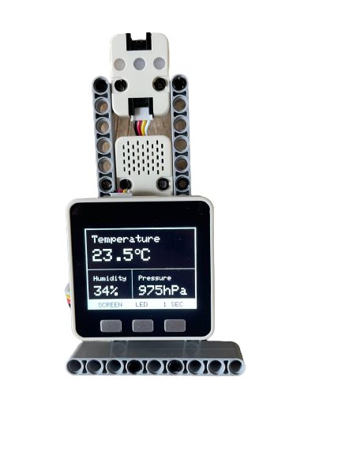

# m5stack-weather-station
 School IoT Project for the M5Stack Basic. With a ESP32 Chip

# Setup
 To be able to use the project on your own, you will need to create a [new Thing](https://create.arduino.cc/iot/things/new]) at the Arduino IoT Cloud.

 Configure the following Variables inside the Arduino IoT Cloud:
 | Name      | Type  |
 | --------- | ----- |
 | enableLED | bool  |
 | hpa       | float |
 | hpa_scale | int   |
 | hum       | float |
 | tmp       | float |
 
 Follow the steps at Arduino Cloud to configure ur device correctly with the service.

 u should then be able to Upload the Sketch and run it on ur Device.

# Modules
 For this to work propperly the should be connected two Modules to ur M5Stack. One beeing a ENV Module to detect hum/tmp and pressure. The secound Module is the RGB module which is used to Show the current Temperature in its Color representation.

Ports:

 RGB Module: Black

 ENV Module: Red

 
